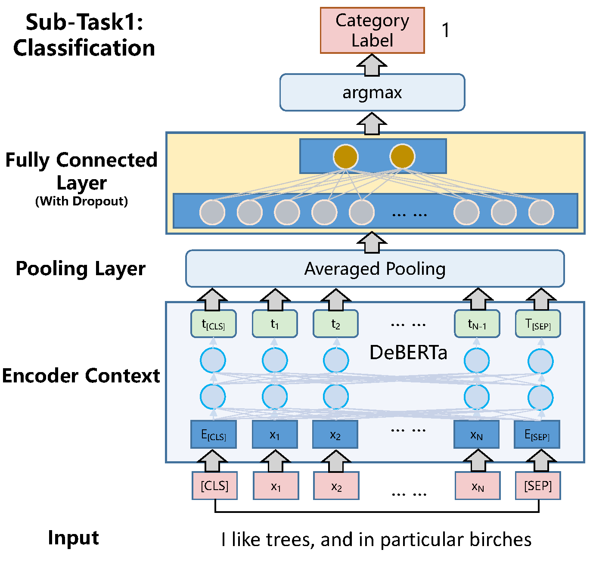

<h3 align="center">
    A Two-Stage Cross-modal Fusion Method for
</h3>
<h3 align="center">
Medical Instructional Video Classification
</h3>
<h4 align="center">
    一种用于医学教学视频分类的两阶段交叉模式融合方法
</h4>
<hr>

<h3 align="center">
    <p>First Place in BioNLP-22 Medical Video Classification </p></h3>

## Method

<center></center>


## Code

Please download the I3D features from [Baidu disk](https://pan.baidu.com/s/1rl6iy1CEYNV43PA-GYdciw?pwd=1234) first, and then unzip *.npy file and put it in `/code/data/features/I3D`.

[Deberta-v3-large](https://huggingface.co/microsoft/deberta-v3-large) model is used by default, or [birdbird](https://huggingface.co/google/bigbird-roberta-large) model can be replaced

The model and experimental records after training will be saved in the `/code/paperlog` folder.

#### One-Stage with language

```
cd code
python Train_One.py
```

#### Two-Stage with language

```
cd code
python Train_Two_1.py
python Train_Two_2.py
```

<center></center>


#### One-Stage with MultiModal

```
cd code
python Train_One_TV.py
```

#### Two-Stage with MultiModal

```
cd code
python Train_Two_1_TV.py
python Train_Two_2_TV.py
```

<center></center>

### Result on offline

<center></center>

## Online Result

<center></center>

Our scheme achieved SOTA performance.

## Citation
Please feel free to cite our [paper]{https://aclanthology.org/2022.bionlp-1.21/).

    @inproceedings{li2022vpai_lab,
      title={Vpai\_lab at medvidqa 2022: A two-stage cross-modal fusion method for medical instructional video classification},
      author={Li, Bin and Weng, Yixuan and Xia, Fei and Sun, Bin and Li, Shutao},
      booktitle={Proceedings of the 21st Workshop on Biomedical Language Processing},
      pages={212--219},
      year={2022}
    }
